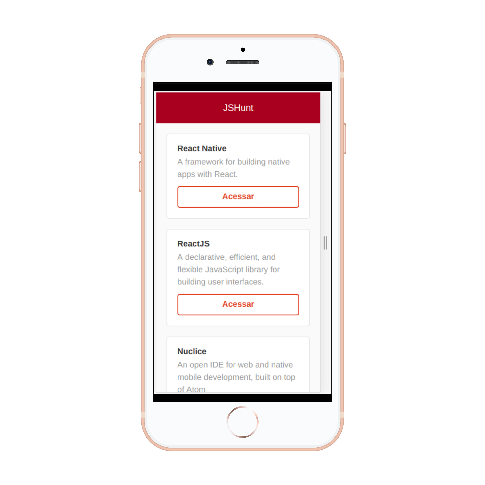

## React App - JS HUNT

This simple app allows users to access a list of resources - links to github repositories with documentation relataded to JavaScript content. This content was got by an API.

  
  

## Technologies

This project was built using these technologies.

- React
- Javascript
- Yarn
- CSS3

 
 

## Prerequisites

- Node
- Yarn

 
 

## Installation

Download or clone the [repo here](https://github.com/thsvr/react-jshunt-tutorial.git), enter the directory in the terminal and run the commands:

- `$ cd react-jshunt-tutorial`
- `$ yarn start`
- Your default browser should open the app at the localhost:3000

 
 
 
 

👤 **Thaís Vieira Azevedo**

- Portfolio: [Thais's Portfolio](https://thais-software-developer.netlify.com/)
- Github: [@thsvr](https://github.com/thsvr)
- Twitter: [@vr_ths](https://twitter.com/vr_ths)
- Linkedin: [Thaís V.](https://www.linkedin.com/in/vr-ths-zd/)
- Email: [vr.ths.zd@gmail.com](vr.ths.zd@gmail.com)

 
 

This app was created following <a href="https://skylab.rocketseat.com.br/node/curso-react-js">this tutorial</a> 
